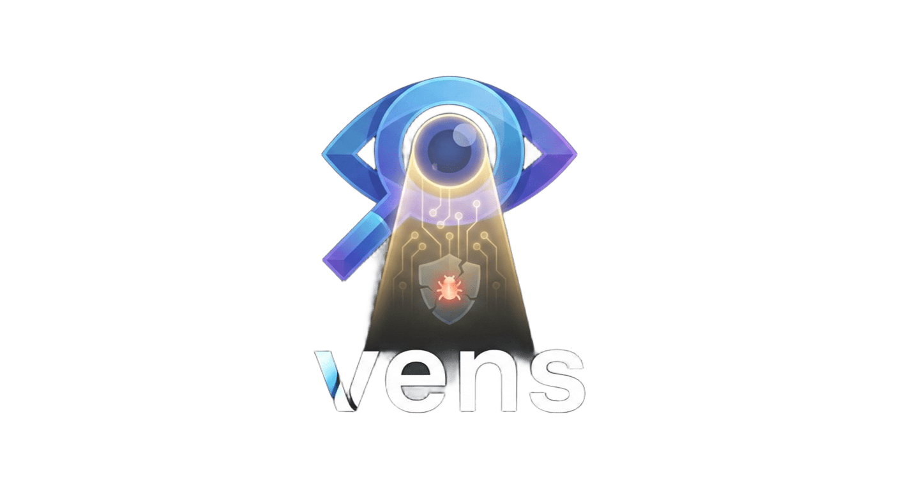

<p align="center">
  
</p>


**Vens** is an AI-powered vulnerability risk scorer. It analyzes security reports and calculates **OWASP Risk Rating scores** for each vulnerability using LLMs, generating precise **CycloneDX VEX** documents with contextual risk scores.

Stop wasting time on contextless CVE lists. Focus on the risks that actually matter.

## 🌐 Vision & Impact

**Vens** is at the forefront of vulnerability management innovation. 

- **First-of-its-kind Open Source**: We are pioneering the use of LLMs to generate risk-scored VEX reports based on OWASP methodology, filling a gap in the open-source ecosystem by providing actionable intelligence for platforms like [Dependency-Track](https://dependencytrack.org/).
- **Pushing the Standards**: We don't just use CycloneDX; we help shape it. We are actively advocating for the CycloneDX specification to better support risk-based prioritization, ensuring that ratings and risk scores are integrated into the heart of security platforms.
  - 🔗 Check out our contribution: [CycloneDX Specification PR #722](https://github.com/CycloneDX/specification/pull/722)

## 🎯 How It Works

Vens uses the **OWASP Risk Rating Methodology** to compute contextual risk scores:

1. **You define your project's context** in `config.yaml` using simple hints:
   - **Exposure**: How is the system exposed? (internal, private, internet)
   - **Data Sensitivity**: What type of data is handled? (low, medium, high, critical)
   - **Business Criticality**: How critical is the system? (low, medium, high, critical)

2. **The LLM analyzes each vulnerability** using your context and calculates the OWASP risk score:
   ```
   CVE-2024-1234 in OpenSSL (RCE):
   ├── Context: internet-exposed, high data sensitivity, critical business
   ├── Threat Agent: 8/9 (public exploits, APT target)
   ├── Vulnerability: 7/9 (easy to exploit, POC available)
   ├── Technical Impact: 8/9 (RCE, data compromise)
   ├── Business Impact: 9/9 (revenue-critical, compliance)
   └── OWASP Score: 63.75/81 → CRITICAL
   ```

3. **Risk score formula** (OWASP Risk Rating Methodology):
   ```
   Likelihood = (Threat Agent + Vulnerability Factor) / 2
   Impact = (Technical Impact + Business Impact) / 2
   Risk = Likelihood × Impact  (range: 0-81)
   ```

## 🚀 Quick Start

### Installation

Option 1: As a standalone program:
```bash
go install github.com/venslabs/vens/cmd/vens@latest
```

Option 2: As a Trivy [plugin](https://aquasecurity.github.io/trivy/latest/docs/plugin/) (see [TRIVY_PLUGIN.md](docs/TRIVY_PLUGIN.md) for details):
```bash
trivy plugin install github.com/venslabs/vens
alias vens="trivy vens"
```

### Usage

```bash
export OPENAI_API_KEY="your-key"

# 1. Scan your image/project with Trivy
trivy image nginx:1.25 --format=json --severity HIGH,CRITICAL > report.json

# 2. Generate OWASP risk scores using LLM
vens generate --config-file config.yaml report.json output_vex.json
```

## ⚙️ Configuration

### Risk Context (`config.yaml`)

Define your project's context using simple hints. The LLM uses these to calculate accurate OWASP risk scores:

```yaml
# vens - Vulnerability Risk Scoring Configuration
project:
  name: "nginx-production"
  description: "Production NGINX web server exposed to internet"

# Context hints for OWASP Risk Rating
# Reference: https://owasp.org/www-community/OWASP_Risk_Rating_Methodology
context:
  # How is the system exposed to potential attackers?
  # Values: internal | private | internet
  exposure: "internet"

  # What type of data does the system handle?
  # Values: low | medium | high | critical
  data_sensitivity: "high"

  # How critical is this system for business operations?
  # Values: low | medium | high | critical
  business_criticality: "critical"

  # Additional context (optional)
  notes: "Handles customer PII, PCI-DSS compliance required"
```

### Context Values Guide

| Field | Value | Description |
|-------|-------|-------------|
| **exposure** | `internal` | Corporate network only, no external access |
| | `private` | Requires VPN or authentication |
| | `internet` | Publicly accessible |
| **data_sensitivity** | `low` | Public data |
| | `medium` | Internal data |
| | `high` | PII, financial data |
| | `critical` | Secrets, credentials, PHI |
| **business_criticality** | `low` | Dev/test environments |
| | `medium` | Internal tools |
| | `high` | Customer-facing services |
| | `critical` | Revenue-critical, compliance |

### LLM Backends

**vens** supports multiple LLM providers. Configure them using environment variables:

| Backend | Flag `--llm` | Environment Variables |
|---------|--------------|-----------------------|
| **OpenAI** (default) | `openai` | `OPENAI_API_KEY`, `OPENAI_MODEL` (optional) |
| **Ollama** | `ollama` | `OLLAMA_MODEL` (e.g., `llama3`), `OLLAMA_BASE_URL` (optional) |
| **Anthropic** | `anthropic` | `ANTHROPIC_API_KEY` |
| **Google AI** | `googleai` | `GOOGLE_API_KEY`, `GOOGLE_MODEL` (optional) |

**Example for Ollama:**
```bash
export OLLAMA_MODEL="llama3"
vens generate --llm ollama --config-file config.yaml report.json output.json
```

## 💻 Command Reference

### `vens generate`

Generate a VEX report with OWASP risk scores by analyzing vulnerabilities using LLM.

**Usage:**
```bash
vens generate [flags] INPUT OUTPUT
```

**Flags:**
| Flag | Description | Default |
|------|-------------|---------|
| `--config-file` | **(Required)** Path to `config.yaml` with context hints | |
| `--llm` | LLM backend (`openai`, `ollama`, `anthropic`, `googleai`) | `auto` |
| `--llm-temperature` | Sampling temperature | `0.0` |
| `--llm-batch-size` | Number of CVEs to process per request | `10` |
| `--llm-seed` | Seed for reproducible results | `0` |
| `--input-format` | Input format (`auto`, `trivy`) | `auto` |
| `--output-format` | Output format (`auto`, `cyclonedxvex`) | `auto` |
| `--debug-dir` | Directory to save debug files (prompts, responses) | |

### `vens enrich`

Enrich a Trivy vulnerability report with OWASP scores from a VEX document.

**Usage:**
```bash
vens enrich --vex VEX_FILE [flags] REPORT_FILE
```

**Flags:**
| Flag | Description | Default |
|------|-------------|---------|
| `--vex` | **(Required)** Path to the VEX file (CycloneDX) | |
| `--output` | Output file path (if not specified, prints to stdout) | |

## 📖 Documentation

- [System Design](docs/system-design/system-design.md): Understand how vens works under the hood.
- [Input Processing](docs/inputs/input-processing.md): Supported formats and data flow.
- [Testing Strategy](docs/testing.md): How we ensure the tool's reliability.

## 🤝 Contributing

Contributions are welcome! Feel free to open an issue or submit a pull request.

## 📄 License

This project is licensed under the Apache License 2.0 - see the [LICENSE](LICENSE) file for details.

---
Made with ❤️ for smarter security.
