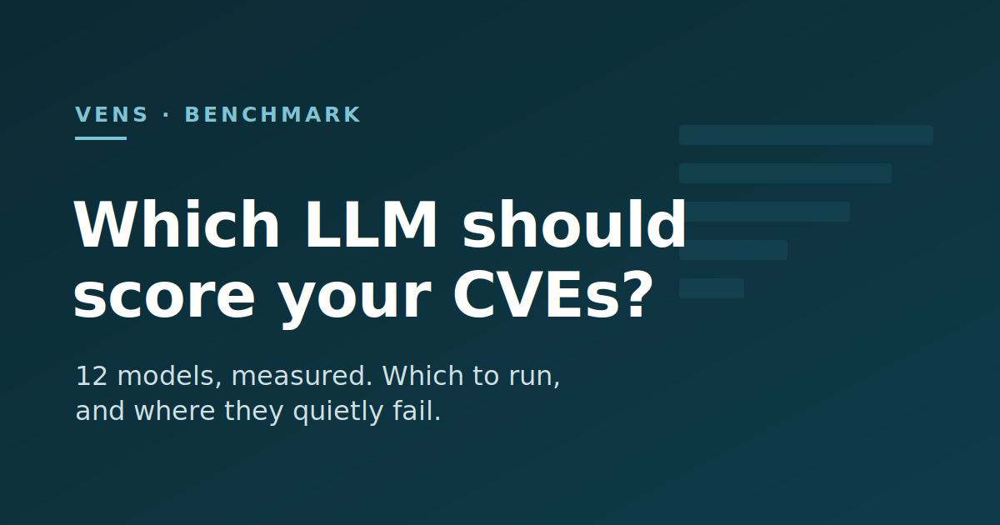

# Which LLM should score your CVEs?

Your scanner finds 400 CVEs. Most don't matter for your system, but the CVSS score can't tell you which: it rates the bug, not your setup.

<!-- more -->

EPSS and the CISA KEV list help (how likely a CVE is to be exploited, and whether it is exploited right now). But they don't know your deployment. Is the service internet-facing? Does it hold user data? Is the vulnerable code even reachable? Answering that for *your* system is the job people now give an LLM: it reads the scanner report plus a short context file that you write (a [`config.yaml`](https://github.com/venslabs/vens/blob/main/examples/quickstart/config.yaml) that describes your project), then adjusts the score. [vens](https://github.com/venslabs/vens) does this.

So which model do you put behind it? I tested 12.

vens's scoring comes down to two skills: **read the CVE**, then **use your context**. So I benchmarked both, each against a simple no-LLM rule it has to beat.

## 1. Reading a CVE is cheap

The first skill: read a CVE and predict its CVSS score. I reused the public [CTIBench](https://github.com/xashru/cti-bench) set for this. Lower error is better.

| Model | Error | $ per 200 CVEs |
|---|---|---|
| claude-sonnet-4-6 | 0.75 | $1.90 |
| gpt-5.5 | 0.75 | $4.12 |
| gpt-5.4-mini | 0.84 | **$0.48** |
| gemini-2.5-flash-lite | 1.15 | $0.07 |
| *constant guess* | 1.57 | $0 |

The two best models tie. gpt-5.5 costs more than 2x the price for the same result, so skip it. A $0.48 model is almost as good. Don't overpay here.

One catch: these CVEs are public, so the models have probably seen their scores during training. This test measures memory as much as reading. Good enough, not solved.

## 2. Context is where cheap models fail

The second skill: change the context, and check that the score moves the right way.

A Log4Shell 10.0 that nothing can reach should drop to LOW. Seven of the eight models do it. A token leak (CVSS 6.5) on a public site full of user data should rise to HIGH. All eight do.

Those two are real CVEs, on purpose. The other context tests use made-up CVEs, so no model can lean on a score it already saw.

Now the baseline. My simple no-LLM rule already does the basic context math. Two cheap models, flash-lite and gpt-5.4-nano, never beat it: they add nothing on top of the rule. They look fine on the first skill, but on context they are useless. So don't pick a model on its accuracy score alone.

## 3. Real understanding, or just matching words?

This is the test I almost skipped. When a model lowers the score for a crash-only bug, is it reasoning? Or is it just reacting to the words "denial of service" in the text?

To find out, I removed those impact words from the descriptions and ran it again.

One case survived. For a bug that tampers with an audit log, the model still saw a real problem, with no keyword to help it. That is real understanding.

One case failed. For the crash bug, once the words were gone, the score jumped back up to the maximum. The model was matching words, not thinking.

(Local models: the four I tried were no better than a fixed guess. Not ready for this job.)

## What to run

- **A score you can defend** → claude-sonnet-4-6. Best and most stable.
- **Cheap and good** → gpt-5.4-mini. Top results for $0.48. It is a bit unstable, so run it a few times and take the middle result.
- **Rough sorting only** → gemini-2.5-flash-lite. Very cheap at $0.07, but weak on context. Use it for a first pass, not for final scores.
- **Skip** → gpt-5.5 (too expensive) and gpt-5.4-nano.

The [paper](https://github.com/venslabs/vens-benchmark/blob/main/paper/vens-benchmark.pdf) has the full numbers and the limits. The [harness](https://github.com/venslabs/vens-benchmark) is public, so you can test any model, including your own.
