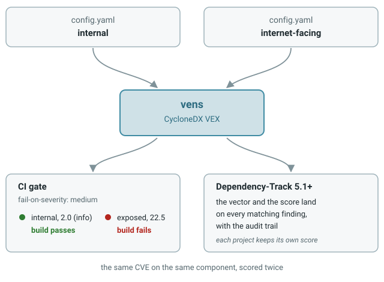

# Send the scores to Dependency-Track

**Who this is for:** teams who already run [Dependency-Track](https://dependencytrack.org/) and want the contextual scores where they audit, not only in a file.
**By the end of this page:** every finding in your project carries the OWASP vector and score Vens computed, with an audit trail showing where it came from.

!!! warning "Dependency-Track 5.1.0 or later"
    Applying an OWASP rating from a VEX import landed in [5.1.0](https://github.com/DependencyTrack/dependency-track/pull/6210). Earlier versions ingest the file and ignore the ratings.



---

## What this does, and what it does not

Vens writes its score into the `ratings` block of the VEX, using the OWASP method. On import, Dependency-Track copies that vector and score onto the matching findings and records the change in their audit trail.

It annotates findings that already exist. It does not create them: Dependency-Track resolves each vulnerability by ID and updates the components it is already attached to. Upload the SBOM first, let the analysis run, then import the VEX.

The rating is stored **per finding**, not on the global vulnerability. The same CVE on the same component can therefore carry a different score in two projects, which is the point: one project is internet facing, the other is not.

---

## Step 1 — Get the findings into a project

```bash
curl -X PUT "$DT_URL/api/v1/bom" \
  -H "X-Api-Key: $DT_API_KEY" \
  -H "Content-Type: application/json" \
  -d "{\"projectName\":\"my-app\",\"projectVersion\":\"internet-facing\",\"autoCreate\":true,\"bom\":\"$(base64 < sbom.cdx.json)\"}"
```

Wait for the BOM to finish processing and for the vulnerability analysis to populate the findings.

!!! tip
    Create one project version per deployment context. Two versions of the same app, `internal` and `internet-facing`, is what lets you compare the two scores side by side.

## Step 2 — Generate the VEX

Use the `config.yaml` that describes *that* context. See [Describe your context](configuration.md).

```bash
vens generate --config-file .vens/internet-facing.yaml report.json vex.cdx.json
```

## Step 3 — Import the VEX

From the UI: open the project, then **Import VEX**.

From the API:

```bash
curl -X PUT "$DT_URL/api/v1/vex" \
  -H "X-Api-Key: $DT_API_KEY" \
  -H "Content-Type: application/json" \
  -d "{\"project\":\"$PROJECT_UUID\",\"vex\":\"$(base64 < vex.cdx.json)\"}"
```

## Step 4 — Look at a finding

Open the project, go to **Audit Vulnerabilities**, and select a finding.

- The **OWASP Risk Rating** panel shows the 16 factors of the vector Vens produced.
- The **audit trail** carries the change, commented `CycloneDX VEX`:

```
OWASP Vector: (None) → SL:5/M:5/O:5/S:5/ED:4/EE:4/A:4/ID:5/LC:5/LI:5/LAV:5/LAC:5/FD:5/RD:5/NC:5/PV:5
OWASP Score:  (None) → 22.5
```

Over the API, the same values are on the finding as `owaspRRVector`, `owaspLikelihoodScore`, `owaspTechnicalImpactScore` and `owaspBusinessImpactScore`.

---

## Known limits

- **Ranking still follows CVSS.** Dependency-Track stores and displays the OWASP score, but severity, the findings list and the dashboards are still driven by CVSS. Two projects with very different contextual scores show the same severity breakdown.
- **The global vulnerability page shows nothing.** The rating lives on the finding, so look under the project's Audit Vulnerabilities tab, not under Vulnerabilities.
- **A CVE absent from the project is skipped.** If the vulnerability is not attached to any component in that project, there is nothing to annotate and the import stays silent about it.
