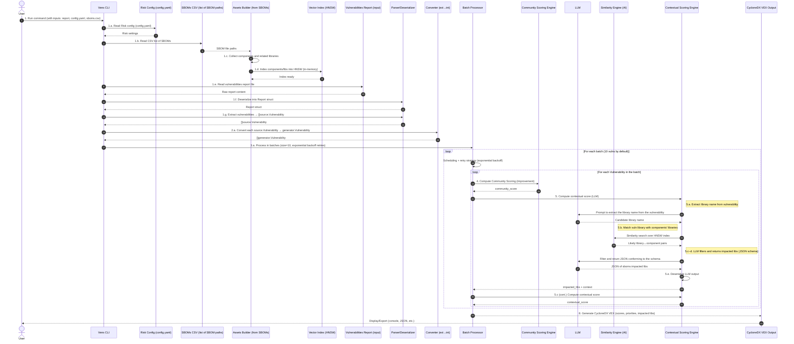
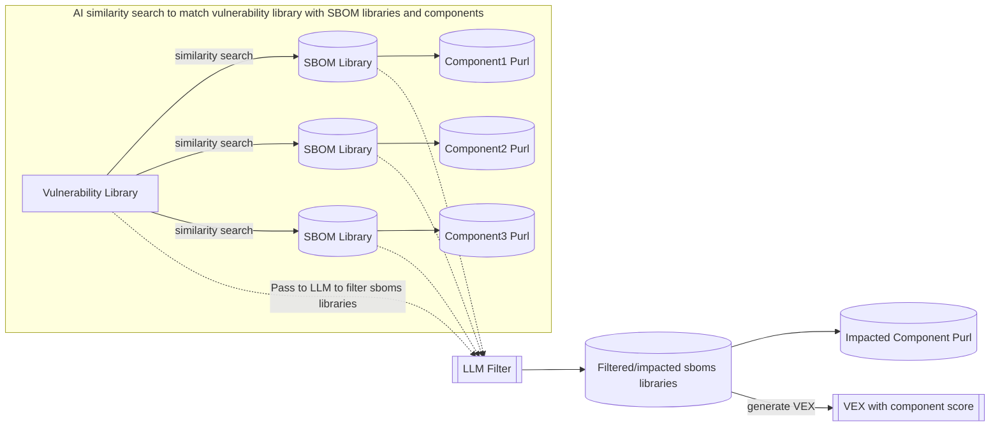

## Sequence Diagram — Vens CLI (data flow)

This diagram describes the end‑to‑end flow as specified (report reading, data conversion, batch processing with exponential backoff, community and contextual scoring via LLM, global score, prioritization, output).



Implementation notes:
- Batch processing: group of 10 vulnerabilities with exponential retries on LLM/IO failures.
- Community scoring: aggregate EPSS/KEV/CVSS/community signals per your strategy.
- Assets context: built from Sboms.

- LLM: structured JSON outputs with a predefined schema for reliable deserialization.
- Output: generate CycloneDX VEX with impacted libraries and computed scores.


## High‑Level Design (Graph) — Vens CLI (exactly aligned with the sequence diagram)

This graph shows the high‑level flow only, aligned with the simplified sequence diagram. It keeps the main steps 1–8 and removes sub‑steps like 1.a or 6.a–6.e for clarity.

```mermaid
flowchart LR
    %% Participants (high-level only)
    User["User"];
    CLI["Vens CLI"];
    Risk["config.yaml - Risk config"];
    SBOMS["csv list of SBOMs"];
    Assets["Assets Builder (from SBOMs)"];
    Vec["Vector Index (HNSW)"];
    FS["Vulnerabilities report"];
    Parser["Parser/Deserializer"];
    Conv["Converter ext to int"];
    Batch["Batch Processor"];
    Comm["Community Scoring Engine"];
    Ctx["Contextual Scoring Engine"];
    Out["CycloneDX VEX Output"];

    %% High-level steps 1–8
    User -->|1. Run command with report, config.yaml, sboms.csv| CLI;
    CLI -->|2. Read Risk config| Risk;
    CLI -->|3. Read SBOMs list| SBOMS;
    SBOMS -->|Build assets context| Assets;
    Assets -->|Index components/libs| Vec;
    Vec -->|Index ready| Assets;
    CLI -->|4. Parse report and extract vulnerabilities| Parser;
    Parser -->|Vulnerabilities| CLI;

    Assets -->|Assets| CLI;

    CLI -->|5. Convert vulnerabilities to internal model| Conv;
    Conv -->|Converted vulnerabilities| CLI;

    CLI -->|6. Process in batches with retries| Batch;

    Batch -->|Compute community scoring| Comm;
    Comm -->|community_score| Batch;

    Batch -->|Compute contextual scoring| Ctx;
    Ctx -->|contextual_score + impacted_libs| Batch;

    %% Final score combination step removed per updated data flow

    Batch -->|8. Generate CycloneDX VEX (scores, priorities, impacted libs)| Out;
    Out -->|Display/Export| User;
```


## System Design (Excalidraw SVG)

The following embedded SVG provides a visual system design overview drawn in Excalidraw.


## Score Factory — Steps

`Score Factory` scoring workflow.


