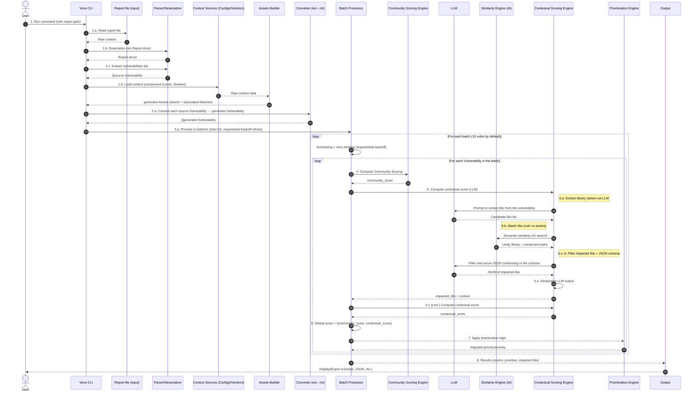
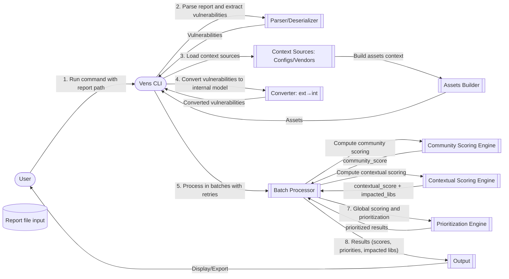

## Sequence Diagram — Vens CLI (data flow)

This diagram describes the end‑to‑end flow as specified (report reading, data conversion, batch processing with exponential backoff, community and contextual scoring via LLM, global score, prioritization, output).

Implementation notes:
- Batch processing: group of 10 vulnerabilities with exponential retries on LLM/IO failures.
- Community scoring: aggregate EPSS/KEV/CVSS/community signals per your strategy.
- Assets context: built from config files or vendors (SBOM, lockfiles, etc.) into generator.Assets.
- LLM: structured JSON outputs with a predefined schema for reliable deserialization.
- Global score: weighted or logical combination (AND/Min) between community and contextual scores.
- Prioritization: apply business rules (SLAs, component/service criticality, exceptions/VEX, etc.).

## High‑Level Design (Graph) — Vens CLI (exactly aligned with the sequence diagram)

This graph shows the high‑level flow only, aligned with the simplified sequence diagram. It keeps the main steps 1–8 and removes sub‑steps like 1.a or 6.a–6.e for clarity.

## System Design (Excalidraw SVG)

The following embedded SVG provides a visual system design overview drawn in Excalidraw.

