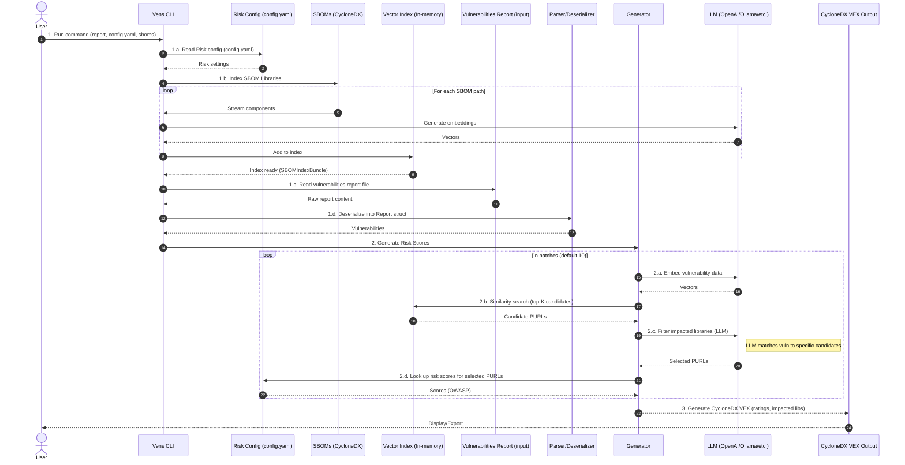
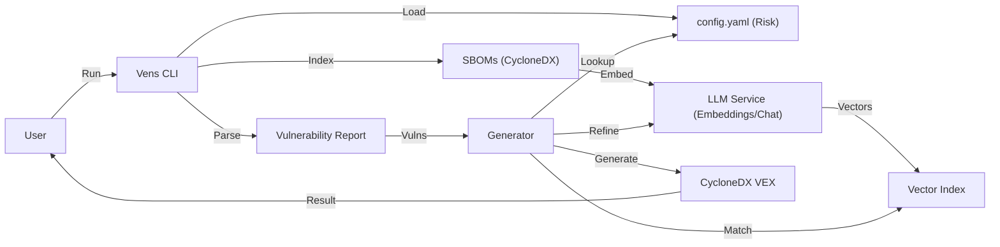
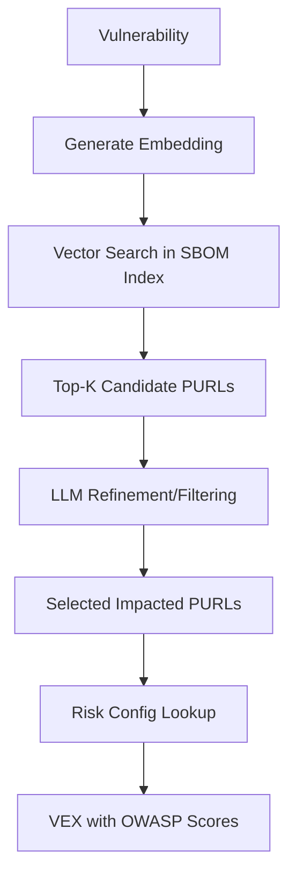

## Sequence Diagram — Vens CLI (data flow)

This diagram describes the end‑to‑end flow as specified (report reading, SBOM indexing, similarity matching, LLM filtering, and VEX generation with risk scores).

Implementation notes:
- **SBOM Indexing**: Components from CycloneDX SBOMs are embedded and stored in an in-memory vector index for efficient similarity matching.
- **Batch Processing**: Vulnerabilities are processed in batches (default 10) to optimize LLM and embedding API calls.
- **Similarity Matching**: Uses vector embeddings to find candidate libraries in the SBOM that might be affected by a vulnerability.
- **LLM Filtering**: An LLM acts as an expert to refine the similarity search results, ensuring only truly relevant libraries are selected.
- **Risk Scoring**: Final scores are derived from user-provided OWASP risk ratings in `config.yaml`, mapped via PURLs.

## High‑Level Design (Graph) — Vens CLI

This graph shows the high‑level architectural components of Vens.

## Core Components

### 1. CLI Layer (`cmd/vens`)
Orchestrates the process, handles flags, and manages file I/O for reports, SBOMs, and configuration.

### 2. Generator (`pkg/generator`)
The central coordinator that:
- Manages SBOM indexing via `IndexSBOMLibraries`.
- Executes the risk scoring workflow in `GenerateRiskScore`.
- Orchestrates batching, embedding, similarity searching, and LLM filtering.

### 3. Vector Index (`pkg/vecindex`)
Provides an in-memory storage and search mechanism for component embeddings, enabling fast identification of candidate libraries.

### 4. Risk Configuration (`pkg/riskconfig`)
Parses and provides access to user-defined OWASP risk scores, mapping PURLs to specific likelihood and impact values.

### 5. LLM Abstraction (`pkg/llm`)
A factory-based layer that supports multiple LLM backends for both text generation (filtering) and vector embeddings.

### 6. SBOM Streamer (`pkg/sbom`)
Efficiently parses large CycloneDX SBOM files using streaming to minimize memory footprint during indexing.

## Risk Scoring Workflow

