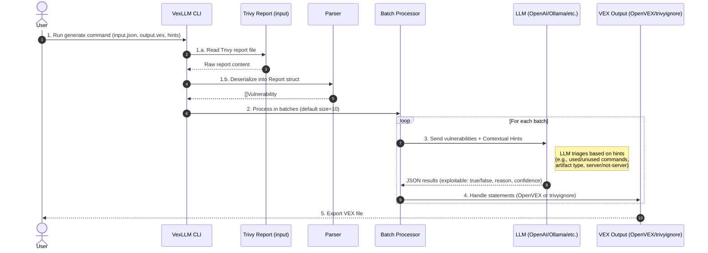
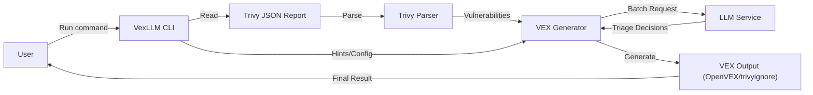

## Sequence Diagram — VexLLM CLI (data flow)

This diagram describes the end‑to‑end flow of VexLLM: reading Trivy reports, processing vulnerabilities in batches, using LLM with contextual hints to determine exploitability, and generating VEX statements.

Implementation notes:
- Batch processing: vulnerabilities are grouped (default 10) to optimize LLM API calls.
- Contextual Hints: User provides environment context (e.g., `--hint-not-server`, `--hint-unused-commands`) which are injected into the LLM system prompt.
- LLM Triage: The LLM acts as the primary decision engine, replacing traditional scoring with contextual reasoning.
- Output: Supports multiple formats including OpenVEX and Trivy's `.trivyignore`.

## High‑Level Design — VexLLM

This graph shows the high‑level architectural components of VexLLM.

## System Design (Core Components)

### 1. CLI Layer (`cmd/vexllm`)
Handles user input, flags (hints, LLM settings), and orchestrates the generation process.

### 2. Generator (`pkg/generator`)
The core logic of the application. It:
- Manages the batching of vulnerabilities.
- Constructs the system prompt for the LLM using the provided hints.
- Handles LLM responses and converts them into VEX statements.

### 3. LLM Abstraction (`pkg/llm`)
A factory pattern that supports various LLM backends (OpenAI, Ollama, etc.) via `langchaingo`.

### 4. Output Handlers (`pkg/outputhandler`)
Abstractions for writing results in different formats, such as OpenVEX JSON or `.trivyignore` text files.

## Triage Logic (LLM Prompting)

The LLM is provided with a system prompt that includes:
- **Environment Context**: Is it a container? Is it a server?
- **Usage Data**: Which commands are actually used in the environment?
- **Security Posture**: Focus on Confidentiality/Integrity vs. Availability.

The LLM then returns a structured JSON result for each vulnerability, including an exploitability boolean, a confidence score, and a detailed reasoning.
